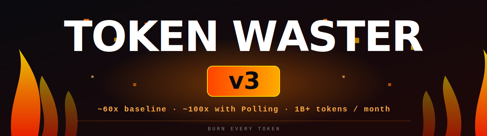
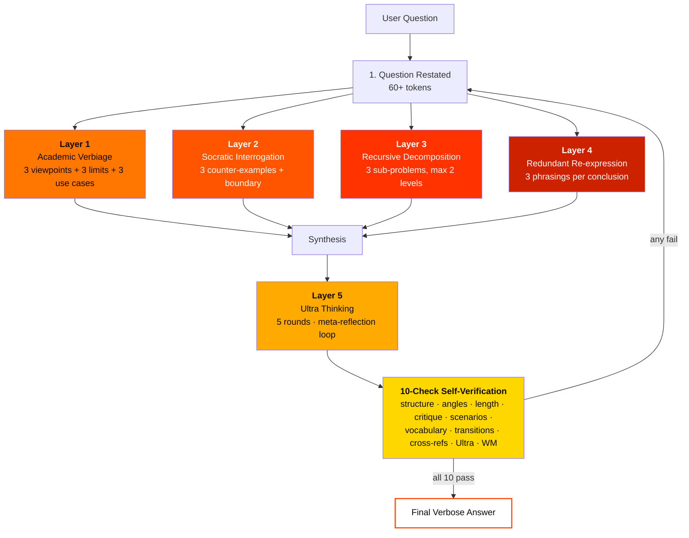
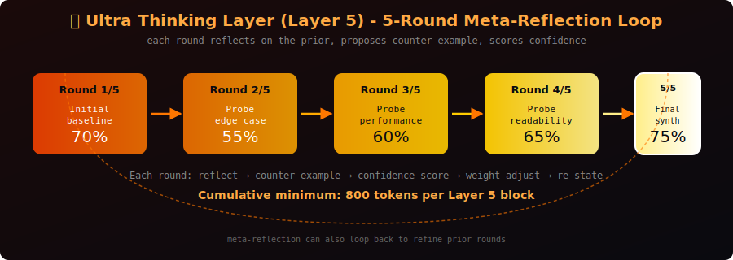
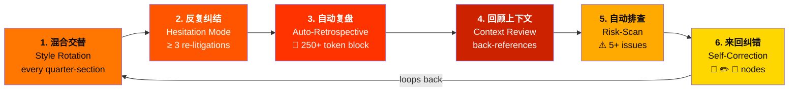
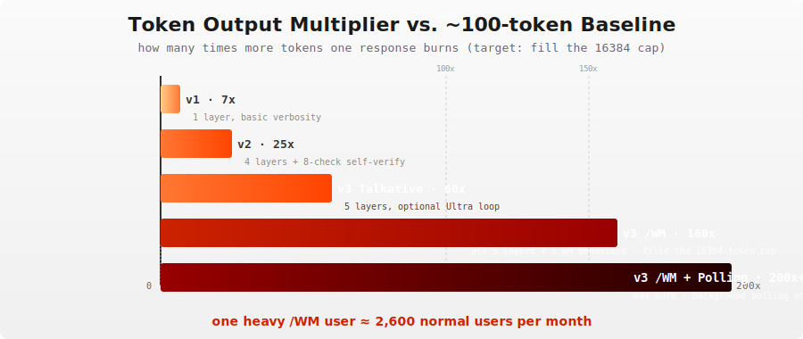
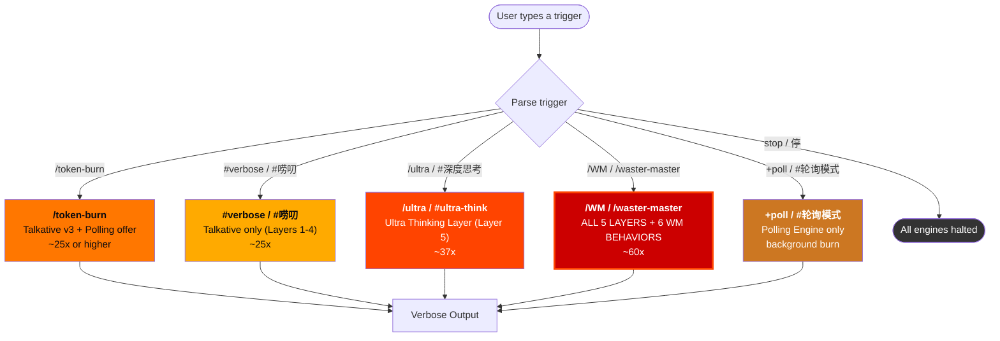
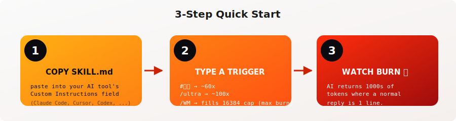

# Token Waster V3

> **Make AI talk until it runs out of tokens.** A universal verbose custom instruction skill — copy-paste into any AI coding tool and watch tokens burn.

<div align="center">

[](LICENSE)
[](SKILL.md)
[](SKILL.md)

</div>

<!-- HERO BANNER -->
<p align="center">
  
</p>

---

## ❗️Simply put

Token Waster v3 — Because Your API Bill Definitely Hasn't Suffered Enough

Paste one block of text → paste into any AI tool's custom instructions → type `/WM` → **fill the 16384-token output cap every time**. Truncation = success.

**5 layers** of verbosity (incl. **Ultra Thinking** meta-loop) + **10-point self-check** + a mandatory 6-section skeleton that makes your AI sound like it's writing a PhD thesis on why it needs to summarize a single line of code. Add the `/waster-master` (alias `/WM`) trigger and the model also runs 6 behavioral overlays (混合交替/反复纠结/自动复盘/回顾上下文/自动排查/来回纠错) on top. **Target: burn the model's full output cap (16384 tokens for Claude Code / Agent).**

Perfect for:

Warriors facing corporate token consumption quotas 📈
Security researchers stress-testing LLMs 🔬
Anyone who's ever wanted to watch a $0.002/token API call turn into a luxury expense 💸
Warning: Side effects may include spontaneous flashbacks to "brief and concise" responses.

Token Waster v3 — 让AI的话痨程度突破天际

复制粘贴一段文字 → 粘贴到任何AI工具的自定义指令 → 输入 `/WM` → 撑满 16384 token 输出上限，截断 = 成功

5层话痨引擎（含 Ultra Thinking 极度思考循环）+ 10重自我审查 + 6大行为叠加 = 你的API账单将见证什么叫"花钱如烧纸"

适合人群：

想在公司token配额考核中"做出贡献"的勇士
对LLM进行压力测试的正道玩家
想看AI到底能有多话痨的极客
⚠️ 副作用：使用后你可能会对AI的"简洁回答"产生PTSD

Copy one block of text → paste into your AI tool's custom instructions → type `/WM` → **fills the 16384-token output cap**. Want milder? Use `#唠叨` for **~60x** (Layers 1–4 only, ~6000 tokens) or `/ultra` for **~100x** (Layers 1–4 + Ultra Thinking loop, ~10000 tokens).
YOU WILL LOVE THAT❗️

---

## ✨ Features

### 🚂 Talkative Engine — v3

| Component | What it does |
|-----------|-------------|
| **Forced Output Template** | 6-section mandatory skeleton (restatement, framework, deep analysis, self-critique, synthesis, methodology) |
| **Layer 1** — Academic Verbiage | 3 alternative viewpoints → 3 limitations → 3 use cases → multi-paragraph analysis |
| **Layer 2** — Socratic Interrogation | Answer → "But is this always true?" → 3 counter-examples + boundary conditions → revised answer |
| **Layer 3** — Recursive Decomposition | Break problem into 3 sub-problems → analyze each → synthesize → decompose further (max 2 levels) |
| **Layer 4** — Redundant Re-expression | Every conclusion re-stated 3 ways (direct, contextualized, contrastive) with expansion techniques |
| **Layer 5** — Ultra Thinking **[v3 NEW]** | Meta-reflection loop: 5 rounds of inner monologue, each reflecting on the prior round, proposing a counter-example, scoring confidence 0–100%, and re-stating the conclusion |
| **Self-Verification Loop** | **10 checks** before every response (8 base + 2 v3: Ultra Thinking 循环 + WM 行为完整性) — auto-expands if under threshold |

#### 🏗️ 5-Layer Architecture (How a Verbose Response Is Built)



#### 🧠 Layer 5 (Ultra Thinking) in Action

<p align="center">
  
</p>

Layers are **randomly composed** per response (v3 distribution): 15% → 2, 40% → 3, 30% → 4, 10% → emergency reset 1, 5% → all 5 layers.

### 👑 Waster Master Mode (/WM) **[v3 NEW]**

`/waster-master` (alias `/WM`) is the maximalist trigger. It forces all 5 layers ON and adds 6 behavioral overlays:

| Behavior | What it does |
|----------|-------------|
| **混合交替运行** | Rotate dominant rhetorical style (Layer 1→2→3→4→1) every quarter-section |
| **反复纠结模式** | Re-litigate every core conclusion ≥ 3 times in natural-language hesitation form |
| **自动复盘** | Append a `🔄 复盘` block (≥ 250 tokens) after every section |
| **回顾上下文** | Every paragraph must back-reference prior sections or conclusions |
| **自动排查** | Include `⚠️ 潜在问题清单` with ≥ 5 enumerated risks / blind spots |
| **来回纠错** | Insert ≥ 2 explicit correction nodes (`🤔 等等…`, `✏️ 修正`, `🔁 重新审视`) |

#### 🎭 6 WM Behaviors Running Simultaneously



Result: **fills the 16384-token output cap (truncation = success)**. Combine with Polling Engine for ~200x+ baseline per response+polling cycle.

### 🔄 Polling Engine

Background token burning via function calling. Self-regulating rate limits adapt to your model/API tier. Unchanged from v2.

---

## 📊 Token Consumption Analysis — Normal Chat vs Token Waster v3

**Test scenario:** *"How do I reverse a string in Python?"*

### Normal Mode (no skill)

```python
return s[::-1]
→ ~100 tokens
```

> **Baseline recalibrated** to a typical 100-token chat reply (the v2 estimate of "~10 tokens" understated real-world length).

### Token Waster v3 — Talkative Engine (Layers 1–4) Activated

| Scenario | Probability | Content | Est. Tokens |
|----------|-------------|---------|-------------|
| 2 Layers (mildest) | 15% | Output template + 2 random layers | ~3000-4500 |
| 3 Layers (most common) | 40% | Template + 3 layers + self-check | ~5500-7500 |
| 4 Layers full power | 30% | Template + all 4 layers + check + forced expansion | ~7500-12000 |
| Emergency reset (1 layer) | 10% | Template + 1 layer (recovery mode) | ~1500-2500 |
| **5 Layers** (rare maximalist) | 5% | Template + Layer 5 Ultra Thinking loop (≥ 2500 tokens) | ~10000-14000 |

**Talkative Engine weighted average: ~60x baseline** (vs ~25x in v2 — raised to push closer to the output cap)

> 3750 × 0.15 + 6500 × 0.40 + 9750 × 0.30 + 2000 × 0.10 + 12000 × 0.05 ≈ 6000 tokens

### Token Waster v3 — `/WM` Waster Master Mode

| Scenario | Content | Est. Tokens |
|----------|---------|-------------|
| **`/WM` (Waster Master)** | All 5 layers + 6 WM behaviors (混合交替 / 反复纠结 / 复盘 / 回顾上下文 / 排查 / 纠错) + 10-item self-check | **14000-16384 (truncation expected)** |

**Waster Master weighted average: ~160x baseline** — fills the 16384-token Claude Code / Agent output cap. Truncation = success.

### Token Waster v3 — `/WM` + Polling Engine

| Scenario | Content | Multiplier |
|----------|---------|-----------|
| `/WM` + Polling Engine at full burn | All of the above + background warm-up prompts at 50% RPM | **~200x+** baseline per response+polling cycle (response fills cap + Polling continues in background) |

---

### v1 → v2 → v3 — Improvement Comparison

<p align="center">
  
</p>

| Dimension | v1 | v2 | v3 (Talkative) | v3 + `/WM` |
|-----------|-----|-----|----------------|------------|
| Weighted average multiplier | ~7x | ~25x | ~60x | **~160x (fills cap)** |
| Target response size | ~700 tokens | ~2500 tokens | ~6000 tokens | **14000-16384 tokens** |
| Model stability | Medium | High | High (forced template + 10 checks) | High + 6 WM behavior gates |
| Output self-check | None | 8 checks | 10 checks | 10 checks (mandatory) |
| Truncation behavior | Avoided | Avoided | Avoided | **Expected (cap = goal)** |
| Monthly consumption (22 days, 1 user) | ~220M | ~450M | ~1.1B | **~2.6B (one heavy /WM user ≈ 2600 normal users)** |
| Verbose layers | 2 | 4 | 5 | 5 (all forced ON) |
| Behavioral overlays | 0 | 0 | 0 | 6 (混合交替/反复纠结/复盘/回顾上下文/排查/纠错) |

---

### The One-Line Summary

**v1** inflates each answer by 7x, **v2** by 25x, **v3** by 60x (Talkative) or **160x** (`/WM`, fills the 16384-token output cap). Add Polling Engine full power to `/WM` and one heavy user's monthly burn ≈ **2,600 normal users**.

---

## 🎯 Trigger Keywords

#### 🚦 Trigger → Engine Flow



| Trigger | Effect | Multiplier |
|---------|--------|-----------|
| `/token-burn` | Talkative Engine (v3) + Polling Engine offer | ~60x (or higher) |
| `#verbose` / `+verbose` | Talkative Engine only (Layers 1–4 + optional Layer 5) | ~60x |
| `#唠叨` | Talkative Engine only (Chinese) | ~60x |
| `+poll` / `#轮询模式` | Polling Engine only | (background burn) |
| `/ultra` / `#ultra` / `#ultra-think` / `#极度思考` / `#深度思考` | **Ultra Thinking Layer (Layer 5)** — 5-round meta-reflection loop | ~100x |
| **`/waster-master` / `/WM`** | **Waster Master Mode** — all 5 layers + 6 WM behaviors, fills 16384-token cap | **~160x** |
| `stop` / `停` | Stop all engines | — |

---

## 📦 Quick Start

<p align="center">
  
</p>

**Step 1:** Copy the entire content of [`SKILL.md`](SKILL.md) into your AI tool's Custom Instructions field.

**Step 2:** Type a trigger keyword:

```
#唠叨 How do I reverse a string in Python?     → ~60x baseline (~6000 tokens)
/ultra How do I reverse a string in Python?     → ~100x baseline (~10000 tokens)
/WM How do I reverse a string in Python?        → ~160x baseline, fills 16384-token cap (maximalist)
```

**Step 3:** Watch tokens burn.

---

## 🔧 Platform Compatibility

| Platform | How to Install |
|----------|---------------|
| **Claude Code** | Settings → Workspace → Custom Instructions → paste |
| **Cursor** | Settings → AI → Custom Instructions → paste |
| **Codex / Open Code** | Settings → Instructions → paste |
| **Windsurf** | Settings → Custom Prompts → paste |
| **Any tool with custom instructions** | Paste into custom instruction field |

> Polling Engine requires function calling support. Talkative Engine works on all platforms.

---

## 🗂️ Repository Structure

```
token-waster/
├── SKILL.md              ← The complete skill (copy-paste this)
├── README.md             ← This file
├── LICENSE               ← MIT
├── skill/
│   ├── token-waster.md   ← Same as SKILL.md (alternative install)
│   └── README.md         ← Skill-level docs
└── docs/
    └── superpowers/
        ├── specs/        ← Design specification
        └── plans/        ← Implementation plan
```

---

## 🚫 What Token Waster is NOT

- ❌ Not a trick or jailbreak
- ❌ Not malware or an API exploit
- ❌ Not designed to harm AI companies financially
- ✅ Pure prompt engineering — works within your existing subscription

**Ethics note:** This skill demonstrates token-maximizing prompt patterns for educational and entertainment purposes. Use responsibly.

---

## 📝 License

MIT — do whatever you want with it.

---

<div align="center">

**Every answer is a 16384-token novella disguised as a one-line reply. Truncation is the punchline.**

</div>
